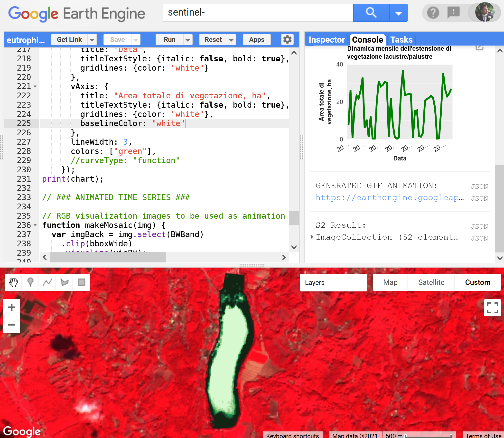

# Monitor aquatic plants from space: the case of Lake Fimon

This code is used in an [publication on eutrophication in Italia (Lago di Fimon)](https://medium.com/@y.vasyunin/lago-di-fimon-9f09ec756903). It is developed to be run inside the [Google Earth Engine](https://earthengine.google.com/) platform. You need to have both Google (Gmail) and Google Earth Engine accounts in order to use it.

The code allows studying the dynamics of the aquatic plants and algae distribution in lake Fimon with [Sentinel-2 MSI: MultiSpectral Instrument, Level-2A](https://developers.google.com/earth-engine/datasets/catalog/COPERNICUS_S2_SR) data. You are free to adapt this code for any other lake i nthe world.

In its current realization, it computes several multispectral image composites, GIF animation, and a chart showing total area covered by vegetatio by month.

## Code structure

The script (`code.js`) is divided into distinct sections:
1. **External packages**
2. **Input variables**
3. **Implementation**
4. **Visualization**
5. **Animated time series**

## Developers

  - [Yaroslav Vasyunin](https://www.linkedin.com/in/vasyunin), independent researcher, Italy
  - [Vasily Lobanov](https://www.linkedin.com/in/lobanov-v/), RUDN University, Moscow

## License

This project is licensed under the [CC BY-SA 4.0](https://creativecommons.org/licenses/by-sa/4.0/deed).

